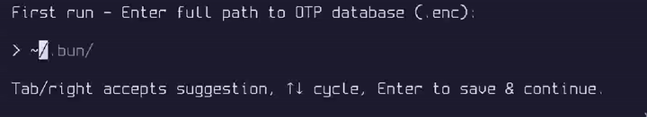

# charm-otp



A simple, keyboard-driven TUI for managing and viewing OTP (TOTP) codes from an encrypted database. Built with [Charmbracelet](https://share.google/TcI5lznpK50mDAswY) tools

## Features

- Password-protected access to OTPClient `.enc` databases
- Fuzzy search and filtering for accounts
- Real-time TOTP generation with countdown timer
- Automatic clipboard copy (Wayland via `wl-copy`)
- Secure clipboard clearing after 5 seconds
- First-run configuration for database path
- Responsive terminal UI with help screen (`?`)
- Keyboard navigation (arrows, tab, page up/down, filtering)

## Requirements

- `otpclient-cli` (for database operations)
- `wl-copy` (from `wl-clipboard` for Wayland clipboard)
- Go 1.24+ (for building)

## Installation

1. Clone this repository:
   ```bash
   git clone https://github.com/yourusername/charm-otp.git
   cd charm-otp
   ```

2. Build the binary:
   ```bash
   make build
   ```

3. (Optional) Install system dependencies:
   ```bash
   # On Debian/Ubuntu
   sudo apt install otpclient wl-clipboard
   ```

4. Run:
   ```bash
   ./charm-otp
   ```

## Usage

- Enter your OTP database password
- On first run, provide path to your `.enc` database file
- Use fuzzy typing to filter accounts
- Navigate with ↑/↓, Tab, Page Up/Down
- Select with Enter to view/copy OTP
- `?` for help, `Esc`/`q` to quit
- OTP auto-clears clipboard after 5s and exits after 3s

The database path is stored in `~/.config/charm-otp/dbpath`.

## Development

```bash
make          # build + test + lint
make test     # run tests
make run      # build and run
make clean    # cleanup
```

## License

MIT © 2026 losthebbian

See [LICENSE](LICENSE) for details.
